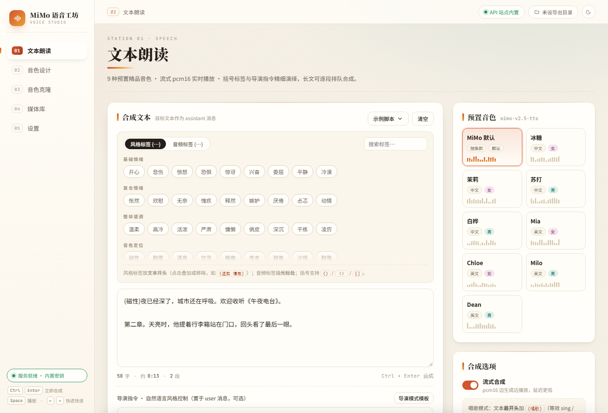

# MiMo 语音工坊 · Voice Studio

浏览器端语音合成工作台：**文本朗读 / 音色设计 / 音色克隆 / 媒体库 / 设置**。
前端是零构建、零依赖的原生 ES Module 单页应用；转发服务与站点函数共用同一份参数白名单校验逻辑。
音频、克隆样本、音色设计与 API Key 全部留在你自己的浏览器（IndexedDB）里，仓库与托管方都不保存任何内容。

在线演示 · [GitHub Pages](https://muge-heng.github.io/mimo-voice-studio/)（纯静态前端，需自备转发服务，见下文「部署形态」）



---

## 它能做什么

| 工作站 | 能力 |
| --- | --- |
| 01 文本朗读 | 9 种预置音色、流式 pcm16 边合成边播放、风格标签 / 音频标签 / 导演指令、**空行分段后逐段排队合成**、唱歌模式 |
| 02 音色设计 | 用自然语言描述音色（`mimo-v2.5-tts-voicedesign`），支持 `optimize_text_preview` 智能润色，每次生成自动存为设计 |
| 03 音色克隆 | 上传 MP3/WAV 或**现场麦克风录制**（自动转 24 kHz 单声道 WAV），样本库管理，`voiceclone` 合成 |
| 04 媒体库 | 生成记录 / 克隆样本 / 音色设计三类资产，搜索、排序、**批量选择导出与删除**、统计条、分享包导入导出 |
| 05 设置 | API Key（`sk-` 按量付费 / `tp-` Token Plan 自动识别）、自建转发地址、导出目录授权、流式开关、存储用量 |
| 全局播放器 | 波形进度条点击跳转、倍速、循环、音量、下载、直接落盘到目录；`Space` 播放、`←/→` 快进快退、`L` 循环、`M` 静音、`Ctrl/⌘ + Enter` 合成 |
| 主题 | 纸质（亮色）与录音棚（暗色）双主题，跟随系统、可切换、可 `?theme=dark` 深链；左侧轨道 + 主舞台 + 检视栏三栏控制台布局 |

## 快速开始

需要 Node.js ≥ 22.18（用于运行 TypeScript 版转发 handler，无需安装任何依赖）。

```bash
git clone https://github.com/muge-heng/mimo-voice-studio.git
cd mimo-voice-studio
npm start                     # → http://127.0.0.1:4173/
```

打开后在「设置」粘贴你的 [MiMo 开放平台](https://xiaomimimo.com) API Key，即可开始合成。
Key 只写入本机浏览器；每次合成把它临时发给**你自己的**这个转发服务，再由它调用官方接口。

可选环境变量：

| 变量 | 作用 |
| --- | --- |
| `PORT` | 监听端口，默认 `4173` |
| `MIMO_API_KEY` | 服务端内置密钥，设置后访客无需自带 Key |
| `MIMO_BASE_URL` | 自定义接入点（私有网关 / 测试桩），必须是干净的 http(s) 源 |
| `MIMO_ENDPOINT` | 无前缀可识别时的默认端点：`pay`（默认）或 `token` |

## 部署形态

前端产物在 `web/`，三种部署方式共用同一套代码，区别只在“谁来转发合成请求”：

1. **本地 / 自建转发（推荐）** —— `node server.mjs` 同时托管 `web/` 与同源 `/functions/v1/app`。
   把它部署在你自己的机器或主机上，静态托管的页面在「设置 · 转发地址」填这个服务的完整地址即可。
2. **GitHub Pages** —— 纯静态，只发布 `web/`（仓库已配好 `.github/workflows/pages.yml`）。
   Pages 不提供服务端，因此合成请求需要一个转发端：要么自建 `server.mjs`，要么把页面与 Qoder Sites / 任意支持 Edge Function 的平台版本搭配使用。
   未配置转发端时，页面仍可正常浏览媒体库、试听历史音频、导出分享包，并在设置里明确提示缺什么。
3. **Qoder Sites** —— `functions/index.ts` + `functions/handler.ts` 是一份 `app` Edge Function（Deno 运行时），
   准备站点时把 `webDirectory` 指向 `web`、`functionDirectory` 指向 `functions`；服务端密钥用应用 Secret `MIMO_API_KEY` 注入。

## 目录结构

```
web/                    前端（零构建）
  index.html            五个工作站的静态结构
  css/studio.css        设计系统：双主题变量、三栏控制台布局、响应式
  icon.svg
  js/
    data.js             静态数据：音色、标签分组、示例脚本、图标（Lucide 风格 SVG）
    app.js              装配层：视图切换、事件绑定、启动流程
    lib/                无 UI 依赖的基础层
      utils.js  db.js  state.js  audio.js  api.js  stream.js
    ui/                 展示层
      toast.js  nav.js  status.js  player.js  panel.js  render.js
    features/           功能层
      generate.js  export.js  mic.js  settings.js
functions/              Qoder Sites Edge Function（Deno）
server.mjs              零依赖 Node 转发服务（本地开发与自建部署）
test/                   自检测试与可视化验收脚本
docs/screenshots/       界面截图
```

依赖方向是单向的：`features → ui → lib`，`app.js` 负责装配。
`ui/nav.js` 暴露一个 `nav.go` 占位函数，由 `app.js` 注入真正的 `switchView`，
`ui/panel.js` 通过 `actions` 参数接收回调 —— 因此不存在循环导入。

## 凭证与隐私

- API Key 存在浏览器 IndexedDB，不进 URL、不进分享包、不进任何持久化日志。
- 转发端（`server.mjs` / Edge Function）只接受**固定官方接入点**或服务端环境变量指定的地址：
  浏览器无法指定转发目标，避免被当作开放代理。
- 转发端对请求做白名单校验：模型名限定 `mimo-v2.5-tts` / `-voicedesign` / `-voiceclone`，
  消息角色限定 `user` / `assistant` 且长度受限，`audio` 只允许 `voice`、`format`、`optimize_text_preview`，
  `voice` 要么是音色名，要么是 `data:audio/(mpeg|wav);base64,` 样本且不超过 10 MB。
- 站点内置密钥（`MIMO_API_KEY`）意味着所有访客共用你的额度，请自行权衡；默认不配置。
- 媒体库数据只在本机，可用「导出分享包」在设备间迁移（JSON，含音频 Base64，不含 Key）。

## 开发

```bash
npm start                       # 前端 + 转发服务
node test/fake-upstream.mjs     # 另开终端：假上游（SSE 与 JSON 两种返回），端口 9099

# 端到端断言（21 项：静态资源、参数白名单、缺密钥、非流式、SSE 透传、客户端中断）
MIMO_API_KEY=test-server-key MIMO_BASE_URL=http://127.0.0.1:9099/v1 \
  node test/selftest.mjs http://127.0.0.1:4173 true

node test/syntax-check.mjs      # CI 语法门禁
npm run qa                      # 用 CDP 驱动无头 Chrome，走完整创作流程并截图到 test/.shots/
```

`test/visual-qa.mjs` 会真实执行“填文本 → 排队合成 → 上传样本 → 克隆合成 → 音色设计 → 媒体库批量选择 → 暗色主题 → 移动端视口”，
并在结束时报告控制台错误与未捕获异常；它需要本机安装 Chrome，路径可用脚本内的 `CHROME` 常量调整。

## 浏览器要求

Chrome / Edge 93+ 效果最完整。目录导出依赖 File System Access API（Safari / Firefox 不支持，页面会明确提示）；
麦克风录制需要安全上下文（`https://` 或 `http://localhost`）。

## 许可

[MIT](LICENSE) © 2026 muge-heng

本项目由一个单文件本地应用（Python 内嵌页面 + `http.server` 代理）重写为站点版：
代理层换成 Edge Function / 零依赖 Node 服务，前端拆分为分层 ES Module，并补齐排队合成、
现场录音、批量管理、双主题与移动端布局。
